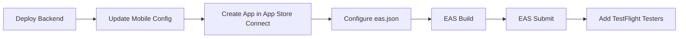

# Deploying an Expo App to TestFlight

A practical, battle-tested guide for getting an Expo (React Native) app onto **TestFlight** for beta testing, with a deployed backend. This documents the exact process used to ship **InternHub**, including the real issues encountered and how to avoid them.

**Stack this guide assumes:**

| Layer | Technology |
|-------|-----------|
| Mobile | Expo (SDK 54+), React Native, TypeScript |
| Backend | Node.js, Express, Socket.IO |
| Database / Storage | Supabase (PostgreSQL + Storage) |
| Build & Submit | EAS (Expo Application Services) |
| Hosting | Railway |

> Replace InternHub-specific values (bundle ID `com.internhub.app`, URLs, IDs) with your own throughout.

---

## Prerequisites

Before you start, make sure you have:

- [ ] An **Apple Developer Program** membership ($99/year) — required for TestFlight
- [ ] An **Expo account** ([expo.dev](https://expo.dev))
- [ ] A **Mac** with the **EAS CLI** installed: `npm install -g eas-cli`
- [ ] Your backend code in a **GitHub repo** (for Railway auto-deploy)
- [ ] A **Supabase** project (or your own database/storage)
- [ ] App assets ready: `icon.png` (1024x1024), splash image

Verify EAS is installed and you're logged in:

```bash
eas --version
eas login
eas whoami   # should print your Expo username
```

---

## Overview



---

## Step 1: Deploy the Backend (Railway)

Your testers need a publicly reachable backend — `localhost` won't work in a production build.

1. Sign up at [railway.com](https://railway.com) (GitHub login recommended).
2. **New Project → Deploy from GitHub repo →** select your repo.
3. Set the **Root Directory** to your backend folder (e.g. `backend`).
4. Configure build/start commands under **Settings**:

   | Setting | Value |
   |---------|-------|
   | Build Command | `npm install && npx prisma generate && npm run build` |
   | Start Command | `npm start` |

5. Under **Variables**, add every environment variable your backend needs. Also set:

   | Variable | Value | Notes |
   |----------|-------|-------|
   | `NODE_ENV` | `production` | |
   | `PORT` | `3000` | |
   | `CLIENT_URL` | `*` | Mobile clients don't enforce CORS; `*` avoids origin rejections |
   | `NODE_VERSION` | `20` | **Critical — see gotcha below** |

6. Deploy and verify the health endpoint:

   ```bash
   curl -L https://YOUR-APP.up.railway.app/health
   # Expected: {"status":"ok","timestamp":"...","environment":"production"}
   ```

### Gotcha: Node version

> `@supabase/supabase-js` v2.93+ pulls in `undici`, which uses the `File` global available only in **Node 20+**. On Node 18 the server crashes at boot with:
> ```
> ReferenceError: File is not defined
> ```
> **Fix:** Set `NODE_VERSION=20` in Railway variables, and pin it in `package.json`:
> ```json
> "engines": { "node": ">=20.0.0" }
> ```

### Gotcha: HTTP → HTTPS redirect

> Hitting the health URL over plain HTTP may return `Moved Permanently` (a 301). This is normal — use `https://` (or `curl -L` to follow the redirect). A `200` with the JSON body means the backend is healthy.

---

## Step 2: Keep Supabase Awake (Production)

> **Supabase Free tier projects pause after 7 days of inactivity.** When a paused project is restored, **its connection credentials change**, which breaks your deployed backend.
>
> **Fix:** Upgrade the Supabase project to the **Pro plan** ($25/month) — Pro projects never auto-pause.

After any restore/credential change, update these in **both** your local `.env` and Railway:

| Env Variable | Where in Supabase |
|---|---|
| `DATABASE_URL` | Connect → URI → **Transaction** mode (port 6543, append `?pgbouncer=true`) |
| `DIRECT_URL` | Connect → URI → **Session** mode (port 5432) |
| `SUPABASE_URL` | Settings → API → Project URL |
| `SUPABASE_SERVICE_KEY` | Settings → API → `service_role` key (the **secret** key, NOT the anon/publishable key) |

Also confirm your **Storage bucket** (e.g. `attachments`) still exists after a restore.

---

## Step 3: Update Mobile Production Config

Point the app at your deployed backend. In your config file (e.g. `mobile/src/constants/config.ts`):

```typescript
export const API_CONFIG = {
  BASE_URL: __DEV__
    ? 'http://localhost:3000/api'
    : 'https://YOUR-APP.up.railway.app/api',   // production

  SOCKET_URL: __DEV__
    ? 'http://localhost:3000'
    : 'https://YOUR-APP.up.railway.app',         // production (no /api)

  TIMEOUT: 30000,
} as const;
```

> Production EAS builds set `__DEV__ = false` automatically, so the production URLs are used without any extra flag.

---

## Step 4: Create the App in App Store Connect

### 4a. Register the Bundle ID

1. Go to [developer.apple.com/account](https://developer.apple.com/account) → **Certificates, Identifiers & Profiles → Identifiers**.
2. Click **+ → App IDs → App**.
3. Set **Description** and **Bundle ID** (Explicit), e.g. `com.internhub.app`.
4. Under **Capabilities**, enable **Push Notifications** if your app uses them.
5. **Continue → Register**.

### 4b. Create the App Listing

1. Go to [appstoreconnect.apple.com](https://appstoreconnect.apple.com) → **Apps → + → New App**.

   | Field | Value |
   |-------|-------|
   | Platforms | iOS |
   | Name | Your app name |
   | Primary Language | English (U.S.) |
   | Bundle ID | Select the one you just registered |
   | SKU | Any unique string (e.g. `myapp-ios-1`) |
   | User Access | Full Access |

2. Click **Create**.

### 4c. Collect three values for EAS

| Value | Where to find it |
|-------|------------------|
| **Apple ID email** | The email you use to sign in to App Store Connect |
| **ASC App ID** | App → General → **App Information** → "Apple ID" (numeric, e.g. `6774813374`) |
| **Apple Team ID** | [developer.apple.com/account](https://developer.apple.com/account) → **Membership details** → Team ID (10 chars, e.g. `B5PT45BDYG`) |

> For **TestFlight-only** testing you do **not** need screenshots, descriptions, pricing, or full App Store review. Those are only required for a public App Store release.

---

## Step 5: Configure `eas.json`

Add a `production` build profile and your Apple submit credentials:

```json
{
  "cli": {
    "version": ">= 16.31.0",
    "appVersionSource": "remote"
  },
  "build": {
    "development": {
      "developmentClient": true,
      "distribution": "internal"
    },
    "preview": {
      "distribution": "internal"
    },
    "production": {
      "autoIncrement": true
    }
  },
  "submit": {
    "production": {
      "ios": {
        "appleId": "you@example.com",
        "ascAppId": "6774813374",
        "appleTeamId": "B5PT45BDYG"
      }
    }
  }
}
```

> `autoIncrement: true` bumps the build number on every production build, so you never collide with an existing TestFlight build.

---

## Step 6: Build with EAS

From your mobile project directory:

```bash
cd mobile
eas build --platform ios --profile production
```

This command is **interactive** the first time. Answer the prompts:

1. **"Log in to your Apple account?"** → Yes → enter Apple ID + password + **2FA code**.
2. **"Generate a new Apple Distribution Certificate?"** → Yes.
3. **"Generate a new Apple Provisioning Profile?"** → Yes.
4. (If asked) let EAS manage the **Push Notifications key** → Yes.

EAS uploads your project and builds in the cloud (~10–20 min), then gives you a build URL.

> **EAS-managed signing:** All certificates and provisioning profiles are stored on Expo's servers, tied to your Expo account — **not** on your laptop. You don't manage `.p12`/`.mobileprovision` files manually.

---

## Step 7: Submit to TestFlight

After the build completes:

```bash
eas submit --platform ios --profile production
```

This uploads the `.ipa` to App Store Connect using the credentials in `eas.json`. The build appears under the **TestFlight** tab after Apple finishes processing (~5–30 min).

> **One-shot alternative:** build and submit together with
> ```bash
> eas build --platform ios --profile production --auto-submit
> ```

### Export compliance

> After upload, Apple may ask about **Export Compliance** (encryption). If your app only uses standard HTTPS, it's exempt. Setting this in your Expo config skips the prompt:
> ```json
> "ios": { "infoPlist": { "ITSAppUsesNonExemptEncryption": false } }
> ```

---

## Step 8: Add TestFlight Testers

In App Store Connect → your app → **TestFlight** tab:

### Internal testers (up to 100, no Apple review)
1. **Internal Testing → +** to create a group.
2. Add testers — they must first be users on your team under **Users and Access**.
3. Assign the build to the group. Invites go out immediately.

### External testers (up to 10,000, requires Beta App Review)
1. **External Testing → +** to create a group.
2. Add testers by email, or generate a **public link** anyone can use to join.
3. The first external build requires a brief **Beta App Review** (usually 24–48h).

### What testers do
1. Install the **TestFlight** app from the App Store.
2. Accept the invite (email link or public link).
3. Install and run your app from TestFlight.

---

## Working Across Multiple Machines

Because EAS signing credentials live on Expo's servers (not your laptop), moving to another Mac is simple:

1. `git pull` the latest (your `config.ts` and `eas.json` changes must be committed/pushed).
2. `cd mobile && npm install`
3. `npm install -g eas-cli` (if missing)
4. `eas login` with the **same Expo account** (`eas whoami` to confirm)
5. Run `eas build` / `eas submit` as above.

> The "same Expo account + same Apple account" is what matters — not the same physical machine. No certificate files need to be copied.

---

## Maintenance & Updates

- **TestFlight builds expire after 90 days** — upload a fresh build to keep testing.
- For each new release: bump `version` in `app.json`, then build + submit again (`autoIncrement` handles the build number).
- Consider **Expo Updates (OTA)** for shipping JS-only changes without a new build/review.
- Monitor backend logs and set a **health check path** (`/health`) on Railway so it auto-restarts on crashes.

---

## Quick Reference Checklist

```text
Backend
[ ] Deployed to Railway, root dir set, build/start commands configured
[ ] NODE_VERSION=20 set (avoids undici "File is not defined")
[ ] NODE_ENV=production, CLIENT_URL=*, all secrets set
[ ] Supabase on Pro plan (no auto-pause); credentials current
[ ] curl https://<url>/health returns 200 ok

Mobile config
[ ] Production BASE_URL / SOCKET_URL point to Railway
[ ] App icon + splash finalized

Apple / App Store Connect
[ ] Apple Developer membership active
[ ] Bundle ID registered (with Push Notifications if used)
[ ] App created in App Store Connect
[ ] Collected: Apple ID email, ASC App ID, Apple Team ID

EAS
[ ] eas.json has production build profile + ios submit credentials
[ ] eas build --platform ios --profile production  (succeeds)
[ ] eas submit --platform ios --profile production (uploads)

TestFlight
[ ] Build appears in TestFlight tab after processing
[ ] Testers added (internal and/or external)
[ ] Verified sign-in + core features on a real device
```
